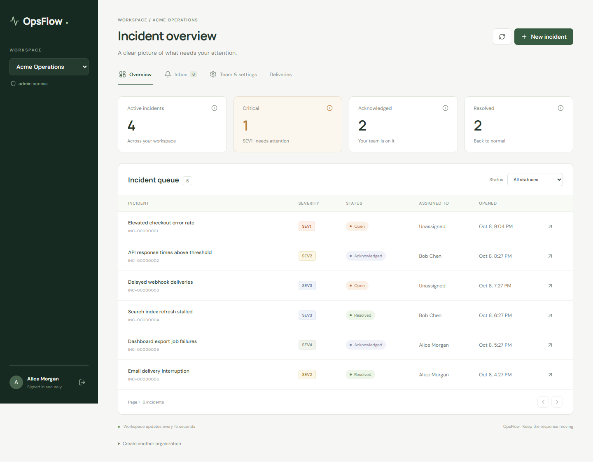

# OpsFlow

A compact multi-tenant incident management platform built with Java 25, Spring Boot, Spring Security, React, TypeScript, PostgreSQL, Redis, Azure Service Bus, Docker, and GitHub Actions.

One API handles organizations, incidents, activity, memberships, and notifications. The browser signs in through an OIDC provider using authorization code + PKCE. PostgreSQL is the source of truth; Redis accelerates dashboard summaries. Durable outbox events deliver in-app notifications through a local background worker or Azure Service Bus.



## Run locally

Install Docker Desktop with Linux containers. From the project root:

```powershell
Copy-Item .env.example .env
docker compose up -d --build
./scripts/seed-demo.ps1
```

Open **http://localhost:5174**. The first build downloads images and Maven dependencies and may take several minutes. The seed script waits for the API and can be run repeatedly.

| Sign-in | Password      | Organization    | Role          |
| ------- | ------------- | --------------- | ------------- |
| alice   | demo-password | Acme Operations | Administrator |
| bob     | demo-password | Acme Operations | Responder     |
| eve     | demo-password | Northstar Labs  | Administrator |

Demo organizations, incidents, and activity are synthetic. These credentials and the Keycloak password-grant client exist only for local demonstrations and load tests. Cloud deployments use your external OIDC provider and contain no demo identities or seeded data.

The database uses port 5434, Redis 6380, Keycloak 8180, API 8080, and frontend 5174, all bound to localhost. Existing services on 5432/5433 are unaffected. `docker compose down` stops the app and preserves data. `docker compose logs api` shows API errors. PostgreSQL and Keycloak data survive restarts.

To use Auth0 with the local app, follow [Auth0 setup](docs/auth0.md). This uses the same OIDC client and Spring JWT validation with a separate environment file.

## What you can do

- Create organizations and switch between your memberships.
- Create and page through incidents; filter by status and view summary statistics.
- Follow **open → acknowledged → resolved**. Administrators can reopen resolved incidents.
- Assign responders and administrators, post updates, and view incident activity.
- Read automatically delivered in-app notifications and mark your own notifications as read.
- Rename organizations; administrators add members by their identity provider's exact OIDC `sub` and manage roles. The final administrator cannot be demoted.
- Inspect recent outbox deliveries and retry failed ones from the administrator screen.

Viewers can read incidents, activity, summaries, and the team list. Responders can create, assign, transition, and comment on incidents. Administrators also manage memberships and organization settings. Every authenticated user can create a new organization and becomes its administrator. Membership management does not create identity-provider accounts or send invitations.

## Security and delivery design

Spring validates JWT signatures, issuer, audience, and expiry. Tenant authorization uses the JWT's subject and a current database membership on every request. Token role claims and client-supplied tenant headers grant no access. Every tenant-owned query includes the organization ID; composite foreign keys prevent cross-organization incident assignments and activity references. Foreign-tenant resources return 404. This is application-enforced isolation, not PostgreSQL row-level security.

Incident mutations, activity, and outbox events share one transaction. The background dispatcher locks pending rows with `FOR UPDATE SKIP LOCKED`. Local mode consumes and completes an event in that database transaction. Azure mode publishes with a stable event ID, then marks it published. If the acknowledgement is lost, duplicate publication remains safe: the consumer's processed-event record and all recipient notifications commit together, with unique constraints and concurrent duplicate tests. Memberships at consumption time determine recipients. Notifications are in-app records; there is no email/SMS provider.

Azure's asynchronous processor explicitly completes messages after the consumer transaction commits. Invalid payloads go directly to the broker DLQ; transient failures are abandoned for redelivery. Queue infrastructure caps delivery at five attempts. Outbox publication retries use exponential delays capped at five minutes and stop after eight failures; administrators can retry. SDK transport retries are separate from broker redelivery and outbox retries. Delivery order is not guaranteed, and activity timestamps remain the authoritative timeline.

Dashboard summaries use tenant-specific Redis keys with a 15-second TTL and eviction after committed changes. Counts can be briefly stale during concurrent reads or Redis failures; incident detail and authorization always use PostgreSQL. Redis failure falls back to database reads. Pagination uses indexed organization/status/creation-time queries, with a page size capped at 100. Activity returns the latest 200 entries and the inbox the latest 50 notifications.

## Verify

Java 25 and Node 24 are needed for source development; Maven is downloaded by the included wrapper. Docker must be running for PostgreSQL integration tests.

```powershell
cd backend
./mvnw.cmd verify
cd ../frontend
npm ci
npm run build
npx playwright install chromium
npm test
```

Browser tests require the Compose app and demo seed. They use real Keycloak sign-in, incident workflows, activity, inbox delivery, and tenant-specific screens. Backend tests use real PostgreSQL through Testcontainers and cover JWT verification, tenant access, roles, stale versions, invalid input, transactional rollback, and concurrent idempotent processing. Azure message-settlement tests cover complete, abandon, and dead-letter decisions; a live Azure acceptance run is still required after deployment.

For local source development: `docker compose up -d postgres redis keycloak`, `./backend/mvnw.cmd -f backend/pom.xml spring-boot:run`, then `npm run dev` in `frontend`.

## Performance evidence

```powershell
./perf/benchmark.ps1 -Users 50 -Duration 30s -Repeats 3
```

This seeds a separate 200,000-incident benchmark organization. It compares the same authenticated summary endpoint and indexed PostgreSQL schema with Redis disabled versus enabled, using identical warm-up requests and simulated concurrent users. It restarts the API between modes, checks successful responses and the expected count, and stores every run plus the median p95 comparison in `perf/results/measured.json`. It restores the previous cache setting afterward. PostgreSQL indexes are present in both runs: this experiment isolates the cache improvement and does not measure the indexes' individual effect. It is a read-only dashboard workload on local Docker, not an all-endpoint or Azure latency claim.

See [performance report](docs/performance.md) for the actual measurements and precise wording you can use. Keep deployment language conditional until you have completed and verified the Azure deployment.

## Azure and CI/CD

Follow [deployment guide](docs/deployment.md). Bicep provisions Azure Container Registry, Container Apps, PostgreSQL Flexible Server, Azure Managed Redis, Service Bus, managed identity permissions, and Log Analytics. A single Container App runs the API and web containers; the web container proxies requests to the API over localhost. The browser and API share one public HTTPS origin. One replica remains active so the notification worker runs without web traffic.

The verification workflow runs backend tests, the frontend build, and browser tests. The deployment workflow tests before publishing immutable Git SHA images and creating a revision, then verifies the public readiness endpoint. Azure deployment stays disabled until repository variables are configured.

## Documentation

- [REST API](docs/api.md)
- [Auth0 setup and local sign-in](docs/auth0.md)
- [Azure deployment and acceptance](docs/deployment.md)
- [Performance report and resume wording](docs/performance.md)
- [Operations and troubleshooting](docs/operations.md)
- [Verification record](docs/verification.md)

Official references used: [Spring JWT resource server](https://docs.spring.io/spring-security/reference/6.5/servlet/oauth2/resource-server/jwt.html), [Service Bus processor](https://learn.microsoft.com/en-us/java/api/com.azure.messaging.servicebus.servicebusclientbuilder.servicebusprocessorclientbuilder?view=azure-java-stable), [dead-letter queues](https://learn.microsoft.com/en-us/azure/service-bus-messaging/service-bus-dead-letter-queues), [Container Apps managed identities](https://learn.microsoft.com/en-us/azure/container-apps/managed-identity), and [Azure Managed Redis Bicep](https://learn.microsoft.com/en-us/azure/templates/microsoft.cache/2025-07-01/redisenterprise).
